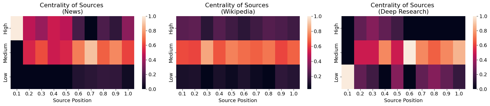
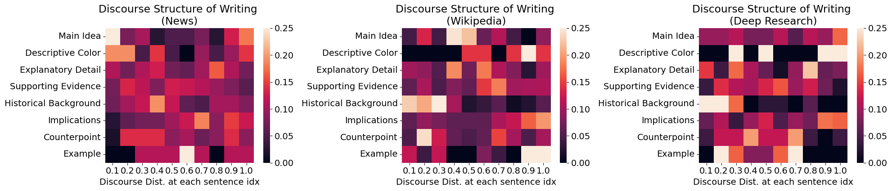

# Deep Research Source and Discourse Analysis

This repository contains an analysis comparing the Deep Research writing process with human-written articles from Wikipedia and established news sources. The goal is to explore how these sources differ in their citation practices and narrative structures.

We label the function, authority, and perspective of every citation, and map the discourse role of each sentence. This analysis reveals the fundamental building blocks of different writing styles.

## Key Research Questions
*   How does the sourcing strategy of Deep Research differ from that of journalists and Wikipedia contributors?
*   Are there measurable differences in how these sources construct narratives and structure their arguments?
*   What patterns emerge in terms of source authority, narrative function, and discourse flow?

## File Structure

The key files and directories for this project are organized as follows:

*   `data/`: This directory contains all raw, intermediate, and final datasets used in the analysis. This includes the parsed articles, citation summaries, and the final labeled dataframes for both citation and discourse analysis.

*   `notebooks/`: This directory contains the Jupyter notebooks used for data processing and analysis.
    *   `notebooks/2025-06-09__label-sources.ipynb`: This is the **main analysis notebook**. It contains all the primary visualizations and statistical comparisons across the three sources (Deep Research, News, Wikipedia).
    *   **Auxiliary Notebooks**: Other notebooks in this directory are used for data cleaning, parsing, and preparation steps (e.g., summarizing citations, structuring discourse data) before the final analysis.

## Key Insights So Far

The analysis has revealed several significant differences in writing style:

1.  **Sourcing Strategy**: News articles prioritize expert opinions and authoritative figures early in the text while Deep Research tends to rely more heavily on news and summarative articles.
2.  **Narrative Structure**: Deep Research articles often focus more on the **implications** and **broader context** of an issue, while news articles tend to build their narratives around **counterpoints** and direct evidence.

3.  **Argument Construction**: A notable pattern is the "inverted authority pyramid" in news articles articles begin with a specific, high-authority sources while Deep Research relies on broader, contextual sources.

For a detailed breakdown of the analytical categories and labels used, please refer to `notebooks/utils_helper.py` (for citation analysis) and `notebooks/utils_discourse.py` (for discourse analysis).

## Future Work

This analysis is ongoing.